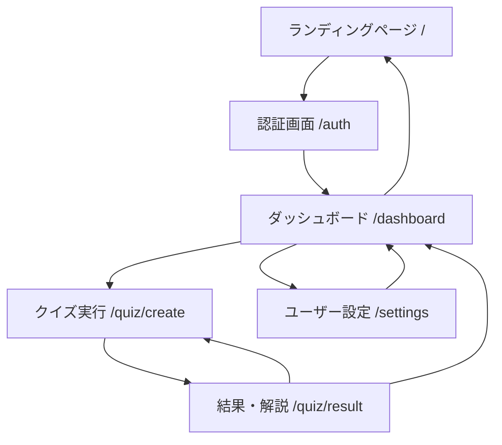

# AI Quiz Crafter - ファイル構成ドキュメント

## 📁 プロジェクト概要

AI Quiz Crafterは、ユーザーの学習ノートからAIが最適化されたクイズを自動生成するWebアプリケーションです。
Next.js App Router + Chakra UI + AWS Amplifyで構築されています。

## 🗂️ ディレクトリ構造

```
AI-Quiz-Crafter/
├── src/
│   ├── app/                    # Next.js App Router
│   │   ├── auth/              # 認証画面
│   │   ├── dashboard/         # メイン画面（3カラムレイアウト）
│   │   ├── quiz/              # クイズ関連
│   │   │   ├── create/        # クイズ実行画面
│   │   │   ├── result/        # 結果・解説画面
│   │   │   └── [category]/    # カテゴリ別クイズ
│   │   ├── review/            # 復習機能
│   │   ├── settings/          # ユーザー設定
│   │   ├── layout.tsx         # ルートレイアウト
│   │   ├── page.tsx           # ランディングページ
│   │   └── providers.tsx      # プロバイダー設定
│   ├── components/            # 再利用可能コンポーネント
│   │   └── common/
│   │       ├── Header/        # 共通ヘッダー
│   │       └── Layout/        # レイアウトラッパー
│   ├── lib/                   # ユーティリティ・設定
│   │   └── amplify.ts         # AWS Amplify設定
│   └── types/                 # TypeScript型定義
│       └── index.ts
├── aws/                       # AWSリソース定義
│   ├── cognito/              # 認証設定
│   ├── lambda/               # Lambda関数
│   └── infrastructure/       # インフラ設定
├── .env.local                # 環境変数（ローカル）
├── .env.example              # 環境変数テンプレート
├── deploy.bat                # 手動デプロイスクリプト
└── package.json              # 依存関係
```

## 📄 主要ファイル詳細

### 🎯 画面構成（App Router）

#### `src/app/page.tsx` - ランディングページ
- システムの概要と認証への導線
- 未認証ユーザーが最初に見る画面
- ヘッダー非表示

#### `src/app/auth/page.tsx` - 認証画面  
- ログイン・新規登録の統合画面
- AWS Amplify Authenticatorを使用
- 認証成功後にダッシュボードへ自動遷移

#### `src/app/dashboard/page.tsx` - メイン画面
- **左カラム**: ノート管理（テキスト、ファイル、Notion連携）
- **中央カラム**: クイズ設定・統計表示
- **右カラム**: AI教師チャット機能
- 認証必須・ヘッダー表示

#### `src/app/quiz/` - クイズ関連
- `create/page.tsx`: クイズ実行画面（問題表示・解答）
- `result/page.tsx`: 結果・解説画面（正誤・AI解説）
- `[category]/page.tsx`: カテゴリ別クイズ一覧

#### `src/app/settings/page.tsx` - ユーザー設定
- プロファイル情報・パスワード変更
- 各種設定項目

### 🧩 共通コンポーネント

#### `src/components/common/Layout/index.tsx`
```typescript
type LayoutProps = {
  children: React.ReactNode
  showHeader?: boolean  // ヘッダー表示制御
}
```
- 全画面の基本レイアウト
- ヘッダーの表示/非表示を制御
- 背景色・最小高さを設定

#### `src/components/common/Header/index.tsx`
- ロゴ・設定アイコン・ログアウト機能
- react-iconsを使用（IoSettings）
- 認証が必要なページでのみ表示

### ⚙️ 設定・ユーティリティ

#### `src/lib/amplify.ts` - AWS Amplify設定
```typescript
Amplify.configure({
  Auth: {
    Cognito: {
      userPoolId: process.env.NEXT_PUBLIC_AWS_USER_POOL_ID!,
      userPoolClientId: process.env.NEXT_PUBLIC_AWS_USER_POOL_CLIENT_ID!,
    }
  }
})
```

#### `src/app/providers.tsx` - プロバイダー設定
- Chakra UIプロバイダー
- Amplify設定の初期化（`import '@/lib/amplify'`）

#### `.env.local` - 環境変数
```bash
NEXT_PUBLIC_AWS_REGION=ap-northeast-1
NEXT_PUBLIC_AWS_USER_POOL_ID=your-user-pool-id
NEXT_PUBLIC_AWS_USER_POOL_CLIENT_ID=your-client-id
```

## 🛠️ 技術スタック

| 領域 | 技術 | 用途 |
|------|------|------|
| **フロントエンド** | Next.js 15 (App Router) | React基盤・ルーティング |
| **UI** | Chakra UI v3 | コンポーネントライブラリ |
| **アイコン** | react-icons | アイコン表示 |
| **認証** | AWS Amplify + Cognito | ユーザー認証・管理 |
| **状態管理** | React Hook Form | フォーム管理 |
| **アニメーション** | Framer Motion | 画面遷移効果 |
| **パッケージ管理** | pnpm | 依存関係管理 |

## 🚀 画面遷移フロー



## 📋 開発・運用

### 開発環境起動
```bash
pnpm install
pnpm run dev
```

### ビルド・デプロイ
```bash
pnpm run build
# 手動デプロイ
deploy.bat
```

### コードチェック
```bash
pnpm run lint
pnpm run type-check
```

## 🔄 今後の拡張予定

1. **Phase 1**: 基本認証・画面遷移
2. **Phase 2**: ノート入力機能・クイズ生成API
3. **Phase 3**: AI教師機能・統計表示
4. **Phase 4**: 共有機能・オフライン対応

---

このファイル構成は、画面遷移図に基づいて効率的に設計されており、段階的な開発が可能な構造になっています。